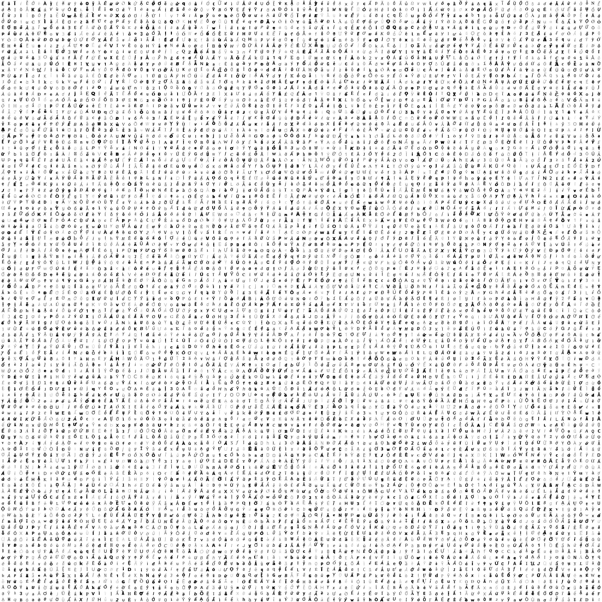

### VietnameseOCR - Vietnamese Optical Character Recognition

Apply Deep Learning ( CNN networks ) to train a model uses for recognizing Vietnamese characters, it works well with Latin characters.

### Dataset in big image ( 10.000 samples, 2800 x 2800 pixel)





### Requirements
```
python 3.6.5
tensorflow
PIL
```


### Model Summary

| Layer         | Shape 		 | 	Kernel   	  |    Stride 	  |   Padding 	|   	 	 |
| -------------:| --------------:|---------------:|--------------:|------------:|-----------:|
| INPUT     	  | [28, 28, 1] 	 |			   	  | 			  |				|			 |
| CONV1			    | 				 | [3, 3, 32, 32] |  	[1, 1]    |    SAME     |   	 	 |
| POOL1         |				 |				  |               |				|			 |
| CONV2		      |				 | [3, 3, 32, 64] |     [1, 1]    |	   SAME		|			 |
| POOL2			    |				 |                |               |				|			 |
| CONV3			    | 				 | [3, 3, 64, 128]|     [1, 1]    |	   SAME		|			 |
| POOL3			    |				 |                |               |				|			 |
| FC1			      | 				 |                |               |				|			 |
| FC2			      | [625, 190]	 |                |               |				|			 |

```
Training...

......
Epoch: 38 cost = 0.312853018
Epoch: 39 cost = 0.298816641
Epoch: 40 cost = 0.293328794

Evaluation
------------------------------
Test Accuracy: 0.974867469544
```


